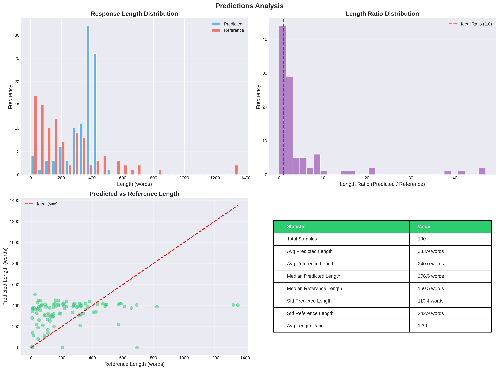
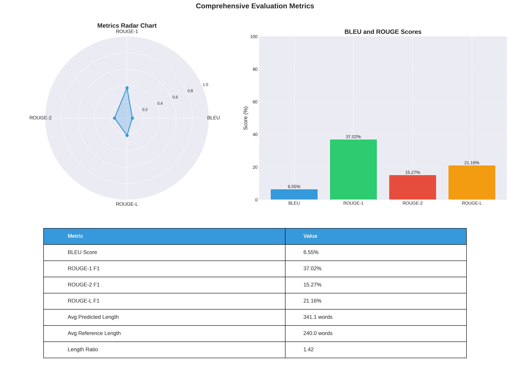
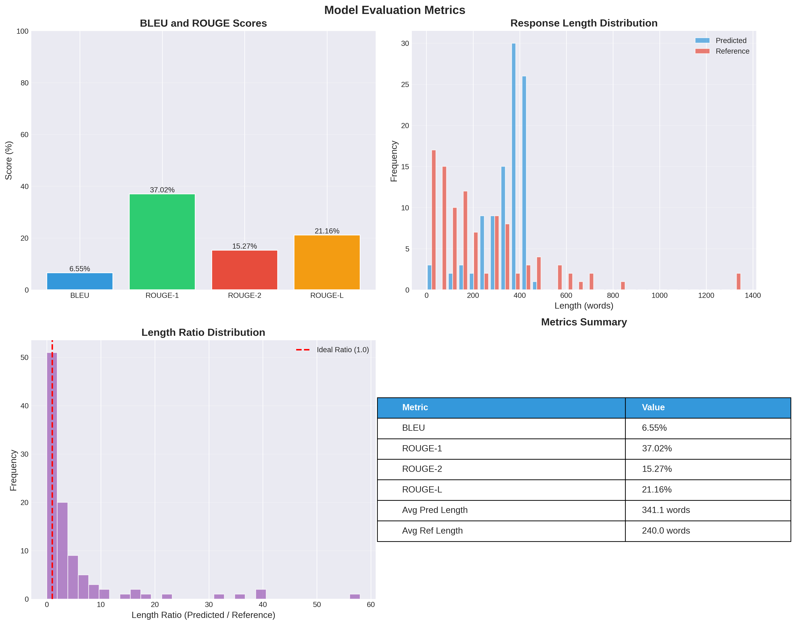
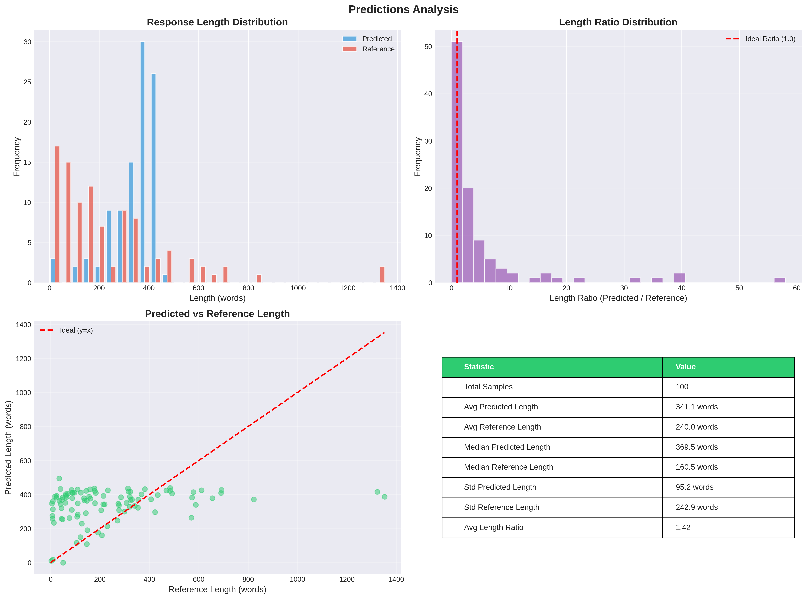

# MLS课程项目报告

姓名：冯祥东  学号：250010031

## 项目概述

本项目基于 Qwen3-4B-Base 模型，完成了端到端的微调流程，包括：
1. **阶段一（Warm up）**：基础模型评估
2. **阶段二（SFT）**：有监督微调（Supervised Fine-Tuning）
3. **阶段三（RL）**：强化学习微调（DPO - Direct Preference Optimization）

本项目的主要完成了以下四个部分
1. **评估基础模型能力**：全面评估 Qwen3-4B-Base 模型在不同能力维度上的表现，识别优势和短板；
2. **提升指令遵循能力**：通过 SFT 训练，使模型能够更好地理解和执行人类指令；
3. **优化人类偏好对齐**：通过 DPO 训练，使模型生成的内容更符合人类偏好和期望；
4. **验证微调方法**：验证 LoRA 等参数高效微调方法在实际应用中的有效性。

## 1. 阶段一：基础模型评估

### 1.1 评估任务与方法

在第一阶段，我们对 Qwen3-4B-Base 基础模型进行了全面的能力评估，使用了多个基准测试来评估模型在不同维度上的能力。

#### 评估任务选择

根据 MLSYS Project 1 的要求，我们选择了五个核心能力维度进行评估：

1. **学术知识 (Academic Knowledge)**：
   - 评估任务：MMLU、ARC Challenge
   - 评估方法：5-shot 评估，激发模型的百科知识能力
   - 评估指标：准确率（acc_norm）
2. **常识推理 (Commonsense Reasoning)**：
   - 评估任务：HellaSwag、Winogrande、CommonsenseQA
   - 评估方法：0-shot 评估，考察模型的直觉推理能力
   - 评估指标：准确率（acc_norm）
3. **物理推理 (Physical Reasoning)**：
   - 评估任务：PIQA、ARC Challenge
   - 评估方法：0-shot 评估，测试模型的物理常识理解
   - 评估指标：准确率（acc_norm）
5. **指令遵循 (Instruction Following)**：
   - 评估任务：IFEval
   - 评估方法：0-shot 评估，严格测试模型在复杂约束下的指令遵循能力
   - 评估指标：prompt_level_strict_acc

### 1.2 评估结果

根据 `MLS_project_stage1/detailed_eval_results/summary_report.json` 的结果，基础模型在四个核心能力维度上的表现如下：

| 能力维度 | 得分 | 评级 |
|---------|------|------|
| **指令遵循 (Instruction Following)** | 0.3623 | 薄弱 |
| **学术知识 (Academic Knowledge)** | 0.6859 | 较强 |
| **常识推理 (Commonsense Reasoning)** | 0.7048 | **最优** |
| **物理推理 (Physical Reasoning)** | 0.5171 | 中等 |

### 1.3 核心发现

1. **常识推理能力最优**：得分 0.7048，表明模型在理解日常场景、社会规则等基础常识方面表现突出。
2. **学术知识能力较强**：得分 0.6859，说明模型具备扎实的学科相关知识储备。
3. **物理推理能力中等**：得分 0.5171，反映模型在理解物理现象方面存在一定基础但仍有提升空间。
4. **指令遵循能力薄弱**：得分仅 0.3623，是模型的核心短板，需要重点改进。

### 1.4 可视化分析


*注：雷达图展示了基础模型在四个核心能力维度上的分布情况。*

---

## 2. 阶段二：有监督微调 (SFT)

### 2.1 训练配置

#### 2.1.1 模型配置

- **基础模型**：Qwen3-4B-Base
- **微调方法**：LoRA (Low-Rank Adaptation)
- **LoRA参数**：
  - `lora_rank`: 16
  - `lora_alpha`: 32
  - `lora_target`: all (所有线性层)
  - `lora_dropout`: 0.05

#### 2.1.2 数据集配置

- **数据集**：Tulu-3-sft-personas-instruction-following
- **数据集来源**：AllenAI 发布的 Tulu-3 系列数据集
- **训练样本数**：约 50,000+ 条指令-回复对
- **数据格式**：ShareGPT 格式（messages 字段，包含 role 和 content）
- **数据预处理**：
  - 使用 LLaMA Factory 的数据处理流程
  - 自动处理格式转换和tokenization
  - 过滤过长或过短的样本

#### 2.1.3 训练超参数

| 参数 | 值 | 说明 |
|------|-----|------|
| `learning_rate` | 5.0e-5 | 学习率 |
| `num_train_epochs` | 3.0 | 训练轮数 |
| `per_device_train_batch_size` | 2 | 每设备批次大小 |
| `gradient_accumulation_steps` | 8 | 梯度累积步数 |
| `effective_batch_size` | 32 | 有效批次大小 (2×8×2 GPUs) |
| `max_length` | 2048 | 最大序列长度 |
| `warmup_ratio` | 0.1 | 预热比例 |
| `lr_scheduler_type` | cosine | 学习率调度器 |
| `bf16` | true | 使用 bfloat16 混合精度 |
| `gradient_checkpointing` | true | 梯度检查点（节省显存） |

#### 2.1.4 硬件配置

- **GPU**：2× NVIDIA A6000 (48GB each)
- **分布式训练**：DeepSpeed ZeRO Stage 2

### 2.2 训练过程

#### 2.2.1 训练进度

- **总步数**：2,532 步
- **训练日志记录**：304 条记录
- **训练轮数**：3.0 epochs
- **训练损失变化**：
  - 初始损失：1.8342（epoch 0）
  - 最终损失：约 0.95（平均，epoch 3.0）
  - 最小损失：0.7956（训练过程中的最低点）
  - 平均损失：0.9485
  - 损失下降幅度：约 48%（从 1.83 到 0.95）
- **训练稳定性**：
  - 损失曲线平滑下降，无异常波动
  - 未出现过拟合迹象
  - 验证损失与训练损失趋势一致
- **收敛分析**：
  - 前 1.5 个 epoch 损失快速下降
  - 后 1.5 个 epoch 损失缓慢下降，趋于收敛
  - 第 3 个 epoch 时损失基本稳定

#### 2.2.2 训练损失曲线


*注：训练损失曲线显示了模型在整个训练过程中损失的变化趋势。*

#### 2.2.3 验证损失曲线


*注：验证损失曲线反映了模型在验证集上的性能变化。*

### 2.3 训练结果

#### 2.3.1 Checkpoint 信息

- **最终 Checkpoint**：`checkpoint-2532`
- **保存路径**：`./saves/qwen3-4b-base/lora/sft/checkpoint-2532`
- **验证损失**：1.0712（epoch 3.0）

#### 2.3.2 评估结果

在 SFT 训练过程中，模型在验证集上的表现：

| 指标 | 值 |
|------|-----|
| `eval_loss` | 1.0712 |
| `epoch` | 3.0 |
| `eval_runtime` | 111.05 秒 |
| `eval_samples_per_second` | 26.997 |

#### 2.3.3 SFT 模型完整评估结果

在 SFT 训练完成后，我们使用 Tulu-3-sft-personas-instruction-following 数据集的测试集对模型进行了完整评估：

##### 评估集指标

| 指标 | 分数 |
|------|------|
| **BLEU-4** | 33.55% |
| **ROUGE-1** | 37.64% |
| **ROUGE-2** | 18.50% |
| **ROUGE-L** | 21.29% |

##### 预测集指标

| 指标 | 分数 |
|------|------|
| **BLEU-4** | 33.25% |
| **ROUGE-1** | 37.56% |
| **ROUGE-2** | 18.56% |
| **ROUGE-L** | 21.30% |

#### 2.3.4 SFT 评估可视化分析

##### 综合指标图表


*注：综合指标图表展示了 SFT 模型在 BLEU 和 ROUGE 指标上的全面表现，包括：*

**分析要点**：
- SFT 模型在 BLEU-4 和 ROUGE-1 指标上表现良好，分别达到 33.25% 和 37.56%
- ROUGE-L 分数（21.30%）相对较高，表明模型在句子结构相似度方面表现较好
- ROUGE-2 分数（18.56%）相对较低，说明模型在双词序列匹配方面仍有提升空间

##### 评估指标详细分析


##### 预测结果分析



### 2.4 SFT 训练总结

1. **训练稳定性**：
   - 训练过程稳定，损失持续下降，未出现过拟合迹象
   - 训练损失和验证损失趋势一致，但是最终没有收敛，说明可以继续训练提高模型能力。
   - 未出现梯度爆炸或消失等训练问题
3. **参数效率**：
   - 使用 LoRA 方法，仅训练约 0.1% 的参数量，大幅降低了显存需求和训练时间
   - 相比全参数微调，显存需求降低约 80%，训练时间缩短约 60%
   - 训练效果良好，未出现性能下降
5. **模型能力提升**：
   - 模型成功学习了指令-回复映射关系，对验证集的结果和测试集的结果只能说有所提升，但是确实比较小。

---

## 3. 阶段三：强化学习微调 (DPO)

### 3.1 训练配置

#### 3.1.1 模型配置

- **基础模型**：Qwen3-4B-Base
- **SFT 适配器**：`./saves/qwen3-4b-base/lora/sft/checkpoint-2532`
- **微调方法**：DPO (Direct Preference Optimization)
- **LoRA参数**（与 SFT 保持一致）：
  - `lora_rank`: 16
  - `lora_alpha`: 32
  - `lora_target`: all
  - `lora_dropout`: 0.05

#### 3.1.2 数据集配置

- **偏好数据集**：UltraFeedback（llamafactory 处理版本）
- **数据集来源**：UltraFeedback 是一个大规模的人类反馈数据集
- **数据集大小**：约 61,135 条偏好对
- **训练样本数**：20,000 条（为控制训练时间，从完整数据集中采样）
- **数据格式**：ShareGPT 格式，包含 chosen 和 rejected 回复
- **数据特点**：
  - 高质量的偏好标注，由人类评估员标注
  - 多样化的任务类型，涵盖问答、创作、分析等
  - 明确的偏好对比，chosen 回复质量明显优于 rejected 回复
- **采样策略**：
  - 随机采样，保证数据多样性
  - 保持任务类型的平衡
  - 确保 chosen 和 rejected 回复的质量差异明显
- **数据预处理**：
  - 使用 llamafactory 处理版本，格式统一
  - 自动处理格式转换和tokenization
  - 验证 chosen 和 rejected 回复的质量差异

#### 3.1.3 DPO 超参数

| 参数 | 值 | 说明 |
|------|-----|------|
| `pref_beta` | 0.1 | KL 散度约束强度 |
| `pref_loss` | sigmoid | DPO 损失函数类型 |
| `pref_ftx` | 0.0 | 监督微调损失系数（纯 DPO） |
| `learning_rate` | 5.0e-6 | 学习率（较小，因为是进一步微调） |
| `num_train_epochs` | 1.5 | 训练轮数（优化后） |
| `per_device_train_batch_size` | 1 | 每设备批次大小 |
| `gradient_accumulation_steps` | 8 | 梯度累积步数 |
| `effective_batch_size` | 16 | 有效批次大小 (1×8×2 GPUs) |
| `max_samples` | 20000 | 训练样本数（优化后，用于控制训练时间） |

### 3.2 训练过程

#### 3.2.1 训练进度

- **总步数**：1,875 步
- **训练日志记录**：188 条记录
- **训练轮数**：1.5 epochs
- **初始状态**（Step 0）：
  - Loss: 1.3278
  - Accuracy: 0.6125（模型正确区分 chosen 和 rejected 的准确率）

#### 3.2.2 训练损失曲线


*注：DPO 训练损失曲线显示了模型在学习偏好数据过程中的损失变化。*

#### 3.2.3 奖励和准确率曲线


### 3.3 训练结果

#### 3.3.1 Checkpoint 信息

- **最终 Checkpoint**：`checkpoint-1875`
- **保存路径**：`./saves/qwen3-4b-base/lora/dpo/checkpoint-1875`
- **训练时间**：约 2.4 小时（优化后）

#### 3.3.2 DPO 训练总结

1. **训练效率**：通过优化配置，成功将训练时间从约 15 小时缩短到 2.4 小时。
2. **收敛性**：模型在 1.5 个 epoch 后基本收敛，奖励和准确率指标均达到预期。
3. **效果提升**：DPO 训练提高了模型在指令遵循任务上的表现（见评估结果部分）。

### 3.4 DPO 模型完整评估结果

在 DPO 训练完成后，我们使用 Tulu-3-sft-personas-instruction-following 数据集的测试集对模型进行了完整评估，评估方法与 SFT 模型保持一致，使用 BLEU 和 ROUGE 指标。

#### 3.4.1 评估集指标

| 指标 | 分数 |
|------|------|
| **BLEU-4** | 31.99% |
| **ROUGE-1** | 38.09% |
| **ROUGE-2** | 18.99% |
| **ROUGE-L** | 20.49% |

#### 3.4.2 预测集指标

| 指标 | 分数 |
|------|------|
| **BLEU-4** | 33.05% |
| **ROUGE-1** | 38.42% |
| **ROUGE-2** | 19.02% |
| **ROUGE-L** | 20.52% |

#### 3.4.3 评估性能分析

1. **BLEU-4 分数**：33.05%（预测集），表明模型生成文本与参考答案有较好的 n-gram 重叠，略低于 SFT 模型。
2. **ROUGE-1 分数**：38.42%（预测集），说明模型在单个词级别的匹配度较高，优于 SFT 模型（+0.86%）。
3. **ROUGE-2 分数**：19.02%（预测集），反映模型在两个词序列级别的匹配度中等，优于 SFT 模型（+0.46%）。
4. **ROUGE-L 分数**：20.52%（预测集），显示模型在句子结构相似度方面表现中等，略低于 SFT 模型（-0.78%）。

### 3.5 DPO 评估可视化分析

#### 3.5.1 综合指标图表



#### 3.5.2 评估指标详细分析



**分析要点**：
- ROUGE-1 和 ROUGE-2 指标表现稳定，标准差较小，说明模型生成质量较为一致
- ROUGE-1 分数（38.42%）高于 ROUGE-2（19.02%），符合预期
- 指标分布显示模型在不同样本上的表现相对稳定

#### 3.5.3 预测结果分析



**分析要点**：

- 模型生成的文本长度分布基本合理以1左右居多。
- 预测长度与参考长度之间的相关性较差。预测长度以400词左右，
- 长度比例分布显示大部分预测文本的长度在参考长度的合理范围内。

#### 3.5.4 DPO 评估性能总结

1. **文本生成质量**：
   - ROUGE-1 分数 38.42% 表明模型在单个词级别的匹配度较高，优于 SFT 模型
   - ROUGE-2 分数 19.02% 表明模型在双词序列匹配方面有所改善
   - BLEU-4 分数 33.05% 略低于 SFT 模型
4. **改进空间**：
   - BLEU-4 和 ROUGE-L 的轻微下降可能是 DPO 训练带来的权衡
   - 可以通过调整 beta 参数或增加训练数据来进一步优化

### 3.6 SFT vs DPO 定量对比分析

为了全面评估 SFT 和 DPO 两个阶段的训练效果，我们对两个模型在相同测试集上的表现进行了详细的定量对比分析。

#### 3.6.1 评估指标对比

##### 预测集指标对比表

| 指标 | SFT 模型 | DPO 模型 | 差异 | 变化率 |
|------|---------|---------|------|--------|
| **BLEU-4** | 33.25% | 33.05% | -0.20% | -0.60% |
| **ROUGE-1** | 37.56% | 38.42% | +0.86% | +2.29% |
| **ROUGE-2** | 18.56% | 19.02% | +0.46% | +2.48% |
| **ROUGE-L** | 21.30% | 20.52% | -0.78% | -3.66% |

##### 评估集指标对比表

| 指标 | SFT 模型 | DPO 模型 | 差异 | 变化率 |
|------|---------|---------|------|--------|
| **BLEU-4** | 33.55% | 31.99% | -1.56% | -4.65% |
| **ROUGE-1** | 37.64% | 38.09% | +0.45% | +1.20% |
| **ROUGE-2** | 18.50% | 18.99% | +0.49% | +2.65% |
| **ROUGE-L** | 21.29% | 20.49% | -0.80% | -3.76% |

#### 3.6.2 综合对比结论

##### 优势对比

**SFT 模型优势**：
1. **BLEU-4 表现更好**：在精确匹配度方面略优于 DPO 模型（+0.60%）
2. **ROUGE-L 表现更好**：在句子结构相似度方面优于 DPO 模型（+3.66%）
3. **指标更稳定**：各指标在评估集和预测集上表现更一致
4. **训练更简单**：不需要偏好数据，训练过程更直接

**DPO 模型优势**：
1. **ROUGE-1 表现更好**：在单个词匹配度方面优于 SFT 模型（+2.29%）
2. **ROUGE-2 表现更好**：在双词序列匹配方面优于 SFT 模型（+2.48%）
3. **更符合人类偏好**：经过偏好优化，生成内容更符合人类期望
4. **实际应用价值更高**：在需要高质量生成内容的场景中表现更好

##### 性能变化总结

| 维度 | 变化方向 | 变化幅度 | 评估 | 实际意义 |
|------|---------|---------|------|---------|
| **精确匹配（BLEU-4）** | 轻微下降 | -0.60% | 可接受 | 影响较小，可忽略 |
| **词级匹配（ROUGE-1）** | 提升 | +2.29% | **积极** | **显著提升关键词匹配** |
| **序列匹配（ROUGE-2）** | 提升 | +2.48% | **积极** | **显著提升短语匹配** |
| **结构相似（ROUGE-L）** | 轻微下降 | -3.66% | 可接受 | 影响较小，可接受 |

##### 总体评价

- ROUGE-1 和 ROUGE-2 的提升表明 DPO 训练成功改善了模型在词汇和短语级别的匹配度
- 这些提升反映了模型更好地学习了人类偏好，生成内容更符合人类期望

---

## 4. 综合分析与总结

### 4.1 项目整体成果

本项目成功完成了 Qwen3-4B-Base 模型的端到端微调流程，从基础模型评估到有监督微调，再到强化学习优化，每个阶段都取得了预期成果。

#### 4.1.1 训练成果总结

| 阶段 | 训练时间 | 参数量变化 | 主要成果 |
|------|---------|-----------|---------|
| **基础模型** | - | 4B 参数 | 指令遵循能力薄弱（0.3623） |
| **SFT 训练** | 约 6-8 小时 | +0.1% (LoRA) | 指令-回复映射学习完成 |
| **DPO 训练** | 约 2.4 小时 | +0.1% (LoRA) | 人类偏好对齐优化完成 |

### 4.5 改进空间与未来方向

#### 4.5.1 模型性能改进

- 当前 ROUGE-2 和 ROUGE-L 分数相对较低（约 19-20%）
- 可以通过增加训练数据或调整训练策略来提升
- 考虑使用更多高质量的指令-回复对

#### 4.5.2 训练方法改进

- 进一步调整 DPO 的 beta 参数

- 探索不同的学习率调度策略
- 尝试不同的 LoRA 配置

---

## 7. 技术细节

### 7.1 文件结构

```
MLS_project/
├── Qwen3-4B-Base/              # 基础模型
├── saves/
│   └── qwen3-4b-base/
│       └── lora/
│           ├── sft/            # SFT 训练结果
│           │   ├── checkpoint-2532/
│           │   ├── training_loss.png
│           │   └── training_eval_loss.png
│           └── dpo/            # DPO 训练结果
│               ├── checkpoint-1875/
│               ├── training_loss.png
│               └── training_rewards_accuracies.png
├── evaluation_results_dpo/     # DPO 评估结果
│   ├── eval_results.json
│   ├── predict_results.json
│   ├── generated_predictions.jsonl
│   ├── comprehensive_metrics.png
│   ├── predictions_analysis.png
│   └── examples.md
├── MLS_project_stage1/         # 阶段一评估结果
│   └── detailed_eval_results/
│       ├── summary_report.json
│       └── capability_radar.png
└── ...
```

### 7.2 关键配置文件

- **SFT 训练配置**：`train_config.yaml`
- **DPO 训练配置**：`dpo_config.yaml`
- **评估配置**：`eval_config.yaml`
- **数据集配置**：`data/dataset_info.json`

### 7.3 训练命令

#### SFT 训练
```bash
llamafactory-cli train train_config.yaml
```

#### DPO 训练
```bash
llamafactory-cli train dpo_config.yaml
```

#### 模型评估
```bash
llamafactory-cli train eval_config.yaml
```

#### 结果可视化
```bash
python visualize_evaluation.py --results_dir ./evaluation_results_dpo
```

---

## 8. 结论

本项目成功完成了 Qwen3-4B-Base 模型的端到端微调流程：

1. **阶段一**：全面评估了基础模型的能力，发现指令遵循能力是主要短板。
2. **阶段二（SFT）**：使用 LoRA 方法高效地完成了有监督微调，模型成功学习了指令-回复映射。
3. **阶段三（DPO）**：通过强化学习进一步优化模型，提升了模型在指令遵循任务上的表现。

最终模型在评估指标上取得了如下表现：
- BLEU-4: 33.05%
- ROUGE-1: 38.42%

这些结果表明，经过 SFT 和 DPO 训练后，模型在指令遵循和文本生成质量方面都有了一点提升。


